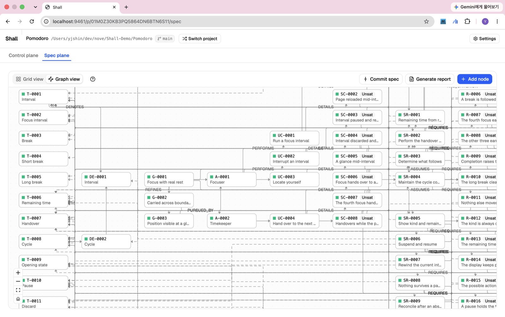

<div align="center">


# Shall

**Spec as the control plane for your agents.**

[](./docs/Shall_Agent_Commands.md)
[](./LICENSE)
[](https://bun.sh)

[**Getting started**](#-getting-started) · [**Working with Shall**](#-working-with-shall) · [**Docs**](./docs)

</div>

Shall keeps your project's specification as a living graph of markdown files inside your own repository, with a local app over it where every judgement — approve, reject, close — stays yours.
Your agents read the same graph through their own commands, so what they build is always the spec you approved.

<p align="center">
  <!-- left screenshot lands here -->
  
</p>

---

## 🧭 Principles Shall stands on

**1. Intent engineering is the last work you'll never delegate.**

We made the spec the control plane for your agents — carrying your intent, enforcing direction, handing out work.

**2. A spec is not a pile of flat documents.**

We structured the spec as an interrelated graph across four planes — domain, intent, plan, and execution.

**3. The spec lives, and keeps changing, until your software dies.**

Change is the normal case, not waterfall reborn — every revision reaches both you and your agents.

## ✨ What you get, working with Shall

**1. Talk through what you want — get a structured spec.**

Tell your agent what you're building.
It asks the right questions and turns your answers into a structured graph of goals, requirements, and plans.

**2. Approve or reject agent work in one place.**

Everything an agent produces shows up for your review — with diffs and evidence attached.
Click approve, or reject with a note.

**3. Agents always know what to work on next.**

The board shows what's ready for your agents.
Agents pick up work and run — on the specs you approved.

**4. Every change traceable, nothing drifts unseen.**

Spec changes are always traceable.
Agents always know the blast radius of their work.
And you always understand where the project stands — and where it's drifting.

---

## 🚀 Getting started

### 1. Install

One self-contained binary — no runtime to install first.

```bash
curl -fsSL https://shall.sh/install | sh
```

Or `brew install nove-lab/tap/shall`, or grab a binary from the [Releases page](https://github.com/Nove-Lab/Shall/releases).
macOS and Linux, Apple Silicon and x64; on Windows, run it inside WSL.
Later, `shall upgrade` replaces the binary with the newest release.

Nothing else to install for the agent side: `shall init` wires the commands below into the project itself.
Shall drives Claude Code and Codex today — the core is agent-agnostic, and each agent gets the same processes in its own grammar.
(Building from source instead: see [CONTRIBUTING.md](./CONTRIBUTING.md).)

### 2. `shall init`

Run it in your project's folder.
It creates `.shall/` — the spec tree the graph is read from and the ledgers your approvals are written to — and registers the project.
The spec is markdown in your repository: version it, diff it, review it like code.

### 3. Open the app

```bash
shall
```

Starts (or reuses) the local daemon and opens `http://localhost:9461` — the Control plane for governing the project and the Spec plane for reading and editing the graph.
Everything stays on your machine.

### 4. Ask your agent

`/shall.help` in Claude Code, `$shall:help` in Codex — any time.
It says what Shall is in a screen, reads where this project stands, and names the one or two commands that move it — the only command that also answers outside a Shall project.

---

## 🔧 Working with Shall

### 1. Driving your agents using Shall

Seven processes, each written as prose — everything they write lands in the Review Queue for your yes.
The process is the same in every agent; only the call wears the agent's own grammar: `/shall.specify` in Claude Code is `$shall:specify` in Codex, and a dotted name like `work.todo` becomes `$shall:work:todo`.

| Process | In one line |
| --- | --- |
| `specify` | interviews you and writes the spec, phase by phase |
| `plan` | designs the layer below — modules, contracts, work items — for one yes |
| `work` | takes one turn of work off the board and writes it up |
| `work.todo` | surveys what the project needs, writes nothing |
| `work.report` | writes up work already done, reconstructed from git |
| `raise` | brings a doubt, lands a finding or a decision — or nothing |
| `help` | says what Shall is and what to run next |

#### 1.1. Specify

**Claude Code** `/shall.specify` — **Codex** `$shall:specify`

The staged elicitation that fills the domain and intent planes: goals, actors, use cases, scenarios, responsibilities, requirements, acceptance criteria and the project's own vocabulary.
Each stage is drafted with you in the terminal, written once agreed, and lands in the Review Queue for your approval; `--auto` runs the stages through and asks once at the end.

#### 1.2. Plan

**Claude Code** `/shall.plan` — **Codex** `$shall:plan`

The design pass one layer below, in two stages.
First it plans the way an agent plans anything — reads the repository, proposes the stack, draws module boundaries, cuts the work — and puts the whole plan to you for one yes, writing nothing.
Then it transcribes the agreed plan in one pass: modules, their contracts, the work items the board will hand out, and the technology decision.
`--auto` skips the terminal yes and nothing else.

#### 1.3. Work

**Claude Code** `/shall.work` — **Codex** `$shall:work`

One turn of the work cycle: survey the board, pick a small bundle, do the development itself outside Shall, self-check the result against each item's definition of done and the criteria it targets, and write the turn up as one journal for the queue.
`--auto` runs without stopping, `--dry` forecasts without writing; `work.todo` is the survey alone and `work.report` writes up work already done.

#### 1.4. Anytime — raise

**Claude Code** `/shall.raise` — **Codex** `$shall:raise`

The door for a doubt rather than a request.
It explores, says what it found, and leaves behind a finding, a decision you dictated, both — or nothing at all.

### 2. Governing your project on Shall

Everything below lives in the app — run `shall` and it opens in your browser at `http://localhost:9461`.
Judgements are yours and are made there; no command approves, rejects or closes anything.

#### 2.1. Review & approve

The Review Queue holds everything waiting on you as cards — spec approvals, work reports, criterion closures, work item completions, standing findings — each with diffs, evidence and context in front.
Approve, reject with a rationale that becomes the agent's work order, close a criterion over its evidence or leave it open with your reason.

#### 2.2. Explore the spec plane

The whole graph on one canvas, grid or graph view, banded domain → intent → plan → execution.
Every node wears its state: red for something to fix, yellow for a judgement still owed, green for settled — plus the second-axis words, Open/Closed on criteria, Blocked/Ready/Done on work items, Sat/Unsat on requirements and scenarios.
Read any node, edit it, or propose its deletion right there.

#### 2.3. Watch the vitals

How far the spec has come and what it still lacks, computed on every read and stored nowhere: satisfaction, closure and completion ratios with drill-downs into what is open and why, and seven spec-health checks for the gaps that are neither errors nor waiting on anyone — every rule always shown, violated ones first.

---

## 📜 License

Shall is licensed under the [GNU Affero General Public License v3.0](./LICENSE).
Contributions are welcome — first-time contributors are asked to sign a short [CLA](./CLA.md) on their pull request.

---

## 📚 Learn more

- [`docs/Project_Structure_and_Architecture.md`](./docs/Project_Structure_and_Architecture.md) — design and invariants
- [`docs/Shall_CLI_Commands.md`](./docs/Shall_CLI_Commands.md) — the `shall` CLI, command by command
- [`docs/Shall_Agent_Commands.md`](./docs/Shall_Agent_Commands.md) — the agent processes, with each agent's spelling
- [`agents/README.md`](./agents/README.md) — the agent-side processes, and how one prose core becomes a plugin per agent
